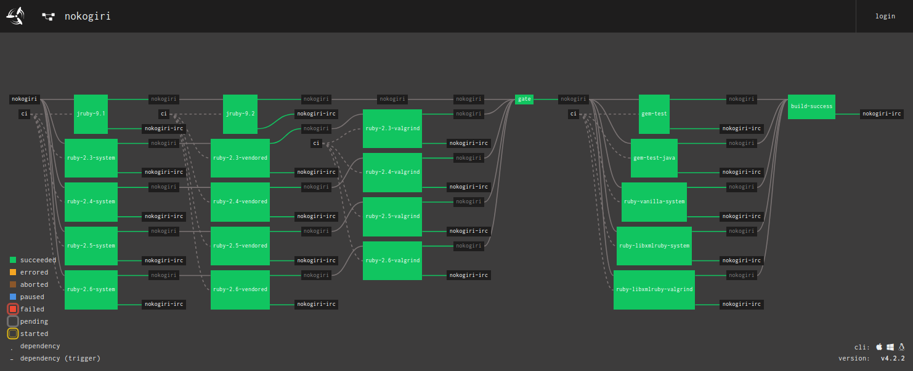

# concourse (the rubygem)

The `concourse` gem provides rake tasks to help you manage Concourse CI pipelines, jobs, and workers, to assist in running tasks with `fly execute`, and even run a local ephemeral deployment of Concourse on your development machine.

If you're not familiar with Concourse CI, you can read up on it at https://concourse-ci.org

Here's an example pipeline maintained by this gem:




## Contents

<!-- to update this TOC run `rake readme_toc` -->

<!-- toc -->

- [Basic Usage](#basic-usage)
  * [Install](#install)
  * [Add to your `Rakefile`](#add-to-your-rakefile)
  * [Set up your Concourse pipeline](#set-up-your-concourse-pipeline)
- [Real-world Examples](#real-world-examples)
- [Concourse pipeline configuration](#concourse-pipeline-configuration)
  * [ERB Templating](#erb-templating)
  * [YTT Templating](#ytt-templating)
  * [Mixing ERB and YTT Templating](#mixing-erb-and-ytt-templating)
  * [Secrets](#secrets)
  * [Multiple pipelines](#multiple-pipelines)
- [Configuration](#configuration)
  * [`directory`: Concourse subdirectory name](#directory-concourse-subdirectory-name)
  * [`fly_target`: Concourse `fly` target name](#fly_target-concourse-fly-target-name)
  * [`ytt`: boolean, or a YTT configuration directory name](#ytt-boolean-or-a-ytt-configuration-directory-name)
  * [`format`: Emit the final pipelines in `fly format-pipeline` canonical format](#format-emit-the-final-pipelines-in-fly-format-pipeline-canonical-format)
  * [`pipeline_erb_filename`: Pipeline filename](#pipeline_erb_filename-pipeline-filename)
  * [`secrets_filename`: Secrets filename](#secrets_filename-secrets-filename)
  * [`fly_args_`: fly command arguments](#fly_args_-fly-command-arguments)
- [Rake Tasks](#rake-tasks)
  * [Manage your Concourse pipeline](#manage-your-concourse-pipeline)
  * [List pipeline tasks](#list-pipeline-tasks)
  * [Run a Concourse task with `fly execute`](#run-a-concourse-task-with-fly-execute)
  * [Abort running builds](#abort-running-builds)
  * [Prune stalled concourse workers](#prune-stalled-concourse-workers)
- [Running a local ephemeral Concourse](#running-a-local-ephemeral-concourse)
  * [Spinning up a local deployment](#spinning-up-a-local-deployment)
  * [Doing things with the local deployment](#doing-things-with-the-local-deployment)
  * [Shutting down the local deployment](#shutting-down-the-local-deployment)
- [Contributing](#contributing)
- [License](#license)

<!-- tocstop -->

## Basic Usage

### Install

Add this line to your application's Gemfile:

```ruby
gem 'concourse'
```

and then run `bundle`.

You can also install it via `gem install concourse`.


### Add to your `Rakefile`

The primary functionality of the Concourse gem is to provide rake tasks. So, in your Rakefile:

``` ruby
require 'concourse'

Concourse.new("myproject").create_tasks!
```

### Set up your Concourse pipeline

``` sh
rake concourse:init
```

The `concourse:init` task will do a few different things for you:

1. create a subdirectory named `concourse` (or whatever you've configured with the `:directory` parameter)
2. create an empty Concourse pipeline file in that subdirectory named `<myproject>.yml` (or whatever you've configured with the `:pipeline_erb_filename` parameter)
3. ensure git will ignore your secrets file named `private.yml` (or whatever you've configured with the `:secrets_filename` parameter)


## Real-world Examples

It might be helpful to look at how other projects are using this gem. Here are a sample, ordered (approximately) from simplest to most complex:

* [`jbarnette/hoe-debugging`](https://github.com/jbarnette/hoe-debugging) has [one pipeline](https://github.com/jbarnette/hoe-debugging/blob/master/concourse/hoe-debugging.yml) that test multiple versions of MRI. ([see it live](https://ci.nokogiri.org/teams/flavorjones/pipelines/hoe-debugging))
* [`flavorjones/hoe-gemspec`](https://github.com/flavorjones/hoe-gemspec) has [one pipeline](https://github.com/flavorjones/hoe-gemspec/blob/master/concourse/hoe-gemspec.yml) that test multiple versions of MRI __and JRuby__. ([see it live](https://ci.nokogiri.org/teams/flavorjones/pipelines/hoe-gemspec))
* [`flavorjones/calendar-assistant`](https://github.com/flavorjones/calendar-assistant) has [one pipeline](https://github.com/flavorjones/calendar-assistant/blob/master/concourse/calendar-assistant.yml) that runs tests against `master` __and pull-requests__, uses __secrets__, and __integrates with Slack__. ([see it live](https://ci.nokogiri.org/teams/calendar-assistants/pipelines/calendar-assistant))
* [`flavorjones/mini_portile`](https://github.com/flavorjones/mini_portile) has [one pipeline](https://github.com/flavorjones/mini_portile/blob/master/concourse/mini_portile.yml) that run tests on both Linux __and Windows__. ([see it live](https://ci.nokogiri.org/teams/nokogiri-core/pipelines/mini_portile))
* [`flavorjones/chromedriver-helper`](https://github.com/flavorjones/chromedriver-helper) has __two pipelines__ that test [master](https://github.com/flavorjones/chromedriver-helper/blob/master/concourse/chromedriver-helper.yml) and [pull requests](https://github.com/flavorjones/chromedriver-helper/blob/master/concourse/chromedriver-helper-pr.yml). (see [Rakefile](https://github.com/flavorjones/chromedriver-helper/blob/master/Rakefile#L9-L12) config) (see [master](https://ci.nokogiri.org/teams/flavorjones/pipelines/chromedriver-helper) and [PR](https://ci.nokogiri.org/teams/flavorjones/pipelines/chromedriver-helper-pr) pipelines live)
* [`sparklemotion/nokogiri`](https://github.com/sparklemotion/nokogiri) has [multiple pipelines](https://github.com/sparklemotion/nokogiri/blob/master/concourse/nokogiri.yml) that __use `require` and `erbify_file` to share common elements__, and __integrate with IRC__. (see [master](https://ci.nokogiri.org/teams/nokogiri-core/pipelines/nokogiri) and [PR](https://ci.nokogiri.org/teams/nokogiri-core/pipelines/nokogiri-pr) pipelines live)


## Concourse pipeline configuration

### ERB Templating

Your Concourse pipeline configuration file, `<myproject>.yml` (or whatever you've configured with the `:pipeline_erb_filename` parameter), will be treated like an ERB template.

The concourse directory is added the `$LOAD_PATH` and so local ruby files may be `require`d if you so desire. Also note that you can include other yaml erb snippets with the method `erbify_file`.

An example using both of these features:

``` yaml
% require "common_prelude" #  will find "common_prelude.rb" in the concourse directory

resources:
<%= erbify_file "common_resources.yml" -%> #  will find this file in the concourse directory and recursively erbify it
  - name: resource_unique_to_this_pipeline
    type: git
    source:
      uri: <%= $common_prelude_defined_uri_prefix %>/username/projectname.git
      branch: master
```

(If you're unfamiliar with ERB and how you can mix Ruby into the document, you can [read about it here](https://www.stuartellis.name/articles/erb/).)


#### `RUBIES`

The ruby variable `RUBIES` is defined in the ERB binding during pipeline file generation. This variable looks like:

``` ruby
  # these numbers/names align with public docker image names
  RUBIES = {
    mri: %w[2.5 2.6 2.7 3.0], # docker repository: "ruby"
    jruby: %w[9.2], # docker repository: "jruby"
    rbx: %w[latest], # docker repository: "rubinius/docker"
    windows: %w[2.3 2.4 2.5 2.6], # windows-ruby-dev-tools-release
    truffle: %w[stable nightly] # docker repository: flavorjones/truffleruby
  }
```

and allows you to write a pipeline like this to get coverage on all the supported rubies:

``` yaml
# myproject.yml
jobs:
% RUBIES[:mri].each do |ruby_version|
  - name: "ruby-<%= ruby_version %>"
    plan:
      ...
      - task: rake-test
        config:
          platform: linux
          image_resource:
            type: docker-image
            source: {repository: "ruby", tag: "<%= ruby_version %>"}
    ...
% end
```

Note that the `windows` rubies are not Docker images, since Concourse's Houdini backend doesn't use Docker. Instead, these are implicitly referring to the supported ruby versions installed by the BOSH release at https://github.com/flavorjones/windows-ruby-dev-tools-release


### YTT Templating

As of v0.39.0, YTT templates are also supported. It's off by default, but you can enable it by passing `ytt: true` to the `Concourse.new` or `Concourse#add_pipeline` calls in your Rakefile (see below for more context).

Your Concourse pipeline configuration file, `<myproject>.yml` (or whatever you've configured with the `:pipeline_erb_filename` parameter), will be treated like a YTT template.

You can optionally specify a directory containing your YTT configuration files (`.star` files and `.yml` templates) so that you can inject project-specific logic.

(If you're unfamiliar with YTT, you can [read about it here](https://get-ytt.io/).)


#### Rubies

These YTT variables are defined by the gem, and can be used in your template:

```starlark
#! ruby.star
cruby_versions = {
    "out_of_support": ["2.4", "2.3", "2.2", "2.1", "2.0.0"],
    "supported": ["2.5", "2.6", "2.7", "3.0"],
    "beta": []
}
jruby_versions = {
    "out_of_support": ["9.1"],
    "supported": ["9.2"],
    "beta": []
}
truffleruby_versions = {
    "supported": ["stable"],
    "out_of_support": [],
    "beta": ["nightly"]
}
```

Here's a simple example:

``` yaml
# myproject.yml

#@ load("ruby.star", "cruby_versions")

---
jobs:
#@ for ruby_version in cruby_versions["supported"]:
  - name: #@ "ruby-{}".format(ruby_version)
    plan:
      ...
      - task: rake-test
        config:
          platform: linux
          image_resource:
            type: docker-image
            source:
              repository: "ruby"
              tag: #@ "mri-{}".format(ruby_version)
    ...
#@ end
```


### Mixing ERB and YTT Templating

Why would you do this? Well, if you really want to, I'll tell you a secret: we treat the YTT templates as though they're *also* ERB templates. So go crazy.


### Secrets

You can use a separate file to keep your pipeline variables secret. By default, `concourse/private.yml` will be used. This filename can also be configured (see below)

If the secrets file exists, it will be passed to the `fly` commandline with the `-l` option to fill in template values.

For example, I might have a concourse config that looks like this:

``` yaml
  - name: nokogiri-pr
    type: pull-request
    source:
      repo: sparklemotion/nokogiri
      access_token: {{github-repo-status-access-token}}
      ignore_paths:
        - concourse/**
```

I can put my access token in `private.yml` like this:

``` yaml
github-repo-status-access-token: "your-token-here"
```

and the final generate template will substitute your credentials into the appropriate place.


### Multiple pipelines

Setting up multiple pipelines might be useful for you, for example one pipeline for running tests against `master` and another for pull requests; or a pipeline for tests and a pipeline for deployments.

If you'd like to set up multiple pipelines, invoke Concourse in your Rakefile like this:

``` ruby
require 'concourse'

Concourse.new("myproject") do |c|
  c.add_pipeline "master", "myproject.yml"
  c.add_pipeline "pull-requests", "pr.yml"
  c.add_pipeline "deploy", "big-red-button.yml"
end
```

Note that when you use the block form:

* it's not necessary to explicitly call `#create_tasks!`
* only the pipelines declared via `#add_pipeline` will be managed

Note also that `Concourse#add_pipeline` takes additional options:

* `ytt`: same as the global `ytt` configuration below


## Configuration

### `directory`: Concourse subdirectory name

You can choose a directory name other than the default `concourse`:

``` ruby
Concourse.new("myproject", directory: "ci").create_tasks!
```


### `fly_target`: Concourse `fly` target name

If the initializer is given no additional parameters, your fly target is assumed to be named "default". But this is likely an inappropriate default, and so you can specify your target name:

``` ruby
Concourse.new("myproject", fly_target: "myci").create_tasks! # `fly -t myci <command>`
```


### `ytt`: Enable YTT templating

By default, this option is `false` and pipelines are treated as ERB templates.

Setting this to `true` will run the file through first ERB (which will be a no-op if you're not using ERB) and then through YTT.

Setting this to a `String` argument containing a directory path will cause YTT to be invoked with a `-f` option loading that directory.


### `format`: Emit the final pipelines in `fly format-pipeline` canonical format

If you'd prefer to have your final pipeline files in `fly`'s "canonical format" (via `format-pipeline`), then set this to true!

``` ruby
Concourse.new("myproject", format: true).create_tasks!
```

This might be useful if you're heavily refactoring your template, and want to make sure there aren't unexpected changes to the pipeline.


### `pipeline_erb_filename`: Pipeline filename

By default the pipeline file will be named `<myproject>.yml`, but can be set to something else:

``` ruby
Concourse.new("myproject", pipeline_erb_filename: "pipeline.yml").create_tasks!
```

Note that the generated, final pipeline file is always named `<pipeline_erb_filename>.generated`.


### `secrets_filename`: Secrets filename

You can use a separate file to keep your pipeline variables secret. By default, `concourse/private.yml` will be used. You can specify a different filename:

``` ruby
Concourse.new("myproject", secrets_filename: "secrets.yml").create_tasks!
```


### `fly_args_<fly_command>`: fly command arguments

Rarely, you may need to inject additional commandline arguments into `fly` to get the behavior you want. For example, I wanted to inject `--enable-across-step` into my `validate-pipeline` commands when I started exploring matrix builds via [the `across` step](https://github.com/vito/rfcs/blob/spatial-resources/029-across-step/proposal.md).

You can pass in additional keys named `fly_args_<command-name-with-underscores>` like this:

``` ruby
Concourse.new("myproject", fly_args_validate_pipeline: "--enable-across-step --another-flag")
```

With the above initializer call, whenever the `concourse` gem invokes `validate-pipeline`, it will inject `--enable-across-step --another-flag`.


## Rake Tasks


### Manage your Concourse pipeline

Tasks to manage a local pipeline file, generated from an ERB template:

```
rake concourse:clean     # remove generated pipeline files
rake concourse:generate  # generate and validate all pipeline files
```

A task to update your pipeline configuration:

```
rake concourse:set       # upload all pipeline files
```

Tasks to publicly expose or hide your pipeline:

```
rake concourse:expose    # expose all pipelines
rake concourse:hide      # hide all pipelines
```

Tasks to pause and unpause your pipeline:

```
rake concourse:pause     # pause all pipelines
rake concourse:unpause   # unpause all pipelines
```

And, should you ever need to [nuke the site from orbit][ripley], a task to destroy your pipeline:

```
rake concourse:destroy   # destroy all pipelines
```

  [ripley]: https://www.youtube.com/watch?v=aCbfMkh940Q


### List pipeline tasks

You can see a list of all the tasks defined in your pipelines:

```
rake concourse:tasks  # list all available tasks from all pipelines
```

You'll see output suitable for the `concourse:task` rake task, formatted as `job-name/task-name`, looking something like:

```
RUNNING: (in /home/flavorjones/code/oss/nokogiri) fly validate-pipeline -c concourse/nokogiri.yml.generated
looks good
NOTE: Available Concourse tasks for nokogiri are:
 * jruby-9.1/rake-test
 * jruby-9.2-pr/rake-test
 * jruby-9.2/rake-test
 * ruby-2.5-system/rake-test
 * ruby-2.5-vendored/rake-test
 * ruby-2.6-system-pr/rake-test
 * ruby-2.6-system/rake-test
 * ruby-2.6-vendored-pr/rake-test
 * ruby-2.6-vendored/rake-test
```


### Run a Concourse task with `fly execute`

You can `fly execute` a task defined in your pipelines:

```
rake concourse:task[job_task,fly_execute_args]  # fly execute the specified task
```

where:

* _required_: `job_task` is formatted as `job-name/task-name`, for example, `ruby-2.7/rake-test`. (See `concourse:tasks` for a list of all available task names.)
* _optional_: `fly_execute_args` will default to map the project directory to a resource with the project name, e.g. `--input=myproject=.`, so your pipeline must name the input resource appropriately in order to use the default.


### Abort running builds

```
rake concourse:abort-builds  # abort all running builds for this pipeline
```


### Prune stalled concourse workers

Especially useful if you're deploying via BOSH, which often results in stalled workers;

```
rake concourse:prune-stalled-workers  # prune any stalled workers
```


## Running a local ephemeral Concourse

You can run a local Concourse deployment on your development system, if you have `docker` and `docker-compose` installed.


### Spinning up a local deployment

To spin up the local cluster:

``` sh
rake concourse:local:up
```

You can view that Concourse deployment at `http://127.0.0.1:8080` using the credentials `test`/`test`.


### Doing things with the local deployment

To target that local cluster, simply prepend the `concourse:local` task on the command line. For example, to `fly execute` a task on the local cluster:

``` sh
rake concourse:local concourse:task[ruby-2.7/rake-task]
```

Or to push your pipelines to that local cluster:

``` sh
rake concourse:local concourse:set
```

### Shutting down the local deployment

Finally, to spin down the cluster (when you're done with it):

``` sh
rake concourse:local:down
```


## Contributing

Bug reports and pull requests are welcome on GitHub at https://github.com/flavorjones/concourse-gem. This project is intended to be a safe, welcoming space for collaboration, and contributors are expected to adhere to the [Contributor Covenant](http://contributor-covenant.org) code of conduct. See [`CODE_OF_CONDUCT.md`](CODE_OF_CONDUCT.md).


## License

The gem is available as open source under the terms of the [MIT License](http://opensource.org/licenses/MIT). See [`LICENSE.txt`](LICENSE.txt).
